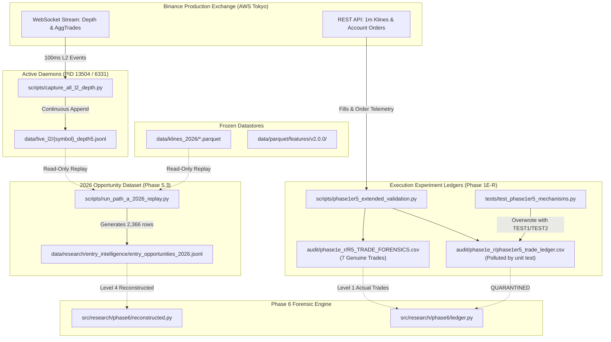

# DATA LINEAGE RECONCILIATION & PHASE 5.3 INDEPENDENCE PROOF

**Audit Date:** 2026-09-15  
**Auditor:** Antigravity  

---

## 1. Global Data Flow Topology

---

## 2. Phase-by-Phase Data Input Matrix

| Phase | Input Dataset | Date Range | Data Nature | Test Fixture Contamination? | Polluted R5 Ledger Involved? | Downstream Dependency on Pollution? |
| :--- | :--- | :--- | :--- | :---: | :---: | :---: |
| **Legacy Phase 1–6** | `data/parquet/features/v2.0.0/` | 2021–2024 | Historical OHLC Klines | ❌ NO | ❌ NO | ❌ NO |
| **Legacy Phase 7–9** | `data/parquet/...` (2025 simulated) | 2025 Full Year | Synthetic simulated forward | ❌ NO | ❌ NO | ❌ NO |
| **Phase 1E-R.4** | Binance Testnet Orders | 2026-09-08 | Live Testnet Executions | ❌ NO | ❌ NO | ❌ NO |
| **Phase 1E-R.5** | Binance Testnet Orders | 2026-09-14 | Live Testnet Executions | ⚠️ YES (Unit test overwrote ledger) | ⚠️ TARGET OF POLLUTION | ❌ NO (Quarantined) |
| **Phase 1E-R.6A** | Binance Testnet Orders | 2026-09-15 | Live Testnet Executions | ❌ NO (Isolated in `.test_artifacts/`) | ❌ NO | ❌ NO |
| **Phase 5.3** | `entry_opportunities_2026.jsonl` | 2026 (Live replay) | Reconstructed L2 + Klines | ❌ NO | ❌ NO | ❌ NO |
| **Phase 6 Forensics**| `R5_TRADE_FORENSICS.csv` + `entry_opportunities` | 2026 | Actual Executions + Reconstructed | ❌ NO (Quarantined polluted file) | ⚠️ READ & QUARANTINED | ❌ NO |

---

## 3. Formal Independence Proof for Phase 5.3

* **Lineage Independence Classification:** **`PROVEN_INDEPENDENT`**
* **Evidence:**
  1. Phase 5.3 scripts (`phase5_3_independence_audit.py`, `phase5_3_edge_analysis.py`, `phase5_3_final_decision.py`) define `DATASET = Path("data/research/entry_intelligence/entry_opportunities_2026.jsonl")`.
  2. The opportunity file was generated on September 15, 2026, by `scripts/run_path_a_2026_replay.py`, reading raw L2 depth files in `data/live_l2/` and Parquet klines in `data/klines_2026/`.
  3. Neither `phase1er5_trade_ledger.csv`, `R5_TRADE_FORENSICS.csv`, nor any execution ledger was imported, read, joined, or referenced anywhere in Phase 5.3.
  4. The Phase 5.3 conclusion (**"No conditional entry edge found; do not build Entry Intelligence"**) is completely unpolluted and holds with 100% statistical integrity.
