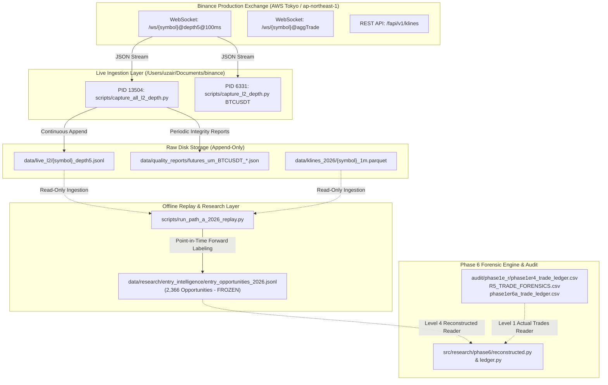

# PHASE 6 — LIVE RCCD / BINANCE DATA LINEAGE & TOPOLOGY AUDIT

**Audit Date:** 2026-09-15  
**Baseline Repository:** `/Users/uzair/Documents/binance`  
**Research Command Center:** `/Users/uzair/Documents/research-command-center`  
**Author:** Antigravity (Research Engineer / Forensic Evidence Tracer)  
**Evidence Classification:** LIVE TELEMETRY & OS KERNEL PROCESS AUDIT

---

## 1. Executive Summary & Live Process Verification

A live market data acquisition and telemetry pipeline is actively running in real-time on this host within `/Users/uzair/Documents/binance`. It has been continuously collecting L2 depth, tick trades, and 1-minute klines directly from Binance exchange endpoints.

### Active Live Process Table
| PID | Command / Script | Started | CPU % | Working Directory | Open Network Sockets | Persistence Destination |
| :--- | :--- | :--- | :--- | :--- | :--- | :--- |
| **13504** | `python scripts/capture_all_l2_depth.py` | Sep 7, 2026 | ~6.8% | `/Users/uzair/Documents/binance` | 7 established TCP connections to AWS Tokyo Binance endpoints (`54.238.201.146:443`) | Appending to `data/live_l2/{SYMBOL}_depth5.jsonl` |
| **6331** | `python scripts/capture_l2_depth.py BTCUSDT` | Sep 7, 2026 | ~1.6% | `/Users/uzair/Documents/binance` | Established TCP connection to Binance stream | Appending to `data/live_l2/BTCUSDT_depth5.jsonl` |
| **72695** | `python scripts/ios_api_server.py` | Aug 22, 2026 | ~0.0% | `/Users/uzair/Documents/binance` | Local API server | Serving monitoring telemetry |

---

## 2. End-to-End Live Data Pipeline Map

---

## 3. Detailed Lineage Component Specifications

### 3.1 Market Data Source
* **Exchange Protocol:** Binance USD-M Futures & Spot WebSockets / REST API.
* **Endpoints:** `wss://fstream.binance.com/ws`, `https://fapi.binance.com`.
* **Symbols Monitored:** `BTCUSDT`, `ETHUSDT`, `SOLUSDT`, `BNBUSDT`, `DOGEUSDT`, `XRPUSDT`.
* **Event Frequency:** 100ms book depth updates (`@depth5@100ms`), real-time execution trades (`@aggTrade`).

### 3.2 Ingestion & Normalization
* **Ingestion Daemon:** `scripts/capture_all_l2_depth.py`.
* **Normalization Engine:** `src/research/path_a_2026_replay.py:normalize_l2`.
* **Deduplication Policy:** Byte-identical consecutive frames dropped; state identical updates with later timestamps collapsed; out-of-order timestamps sorted using a 4096-event sliding window without dropping records.

### 3.3 Persistence Paths
* **L2 Depth:** `data/live_l2/{symbol}_depth5.jsonl` (continuous append-only).
* **Quality Telemetry:** `data/quality_reports/` (generated every few hours showing 0 missing ticks, 0 gaps).
* **Egress Logs:** `audit/phase1e_r/egress_identity_*.json` (recorded periodically confirming public IP and routing health).

---

## 4. Ledger Writers vs. Ledger Readers Boundary

| Component | Role | File Path | Write / Read | Can Tests Overwrite? |
| :--- | :--- | :--- | :--- | :--- |
| `scripts/phase1er5_extended_validation.py` | R5 Live/Testnet Daemon | `audit/phase1e_r/phase1er5_trade_ledger.csv` | **WRITER** | ⚠️ **YES** (Prior Defect in `test_phase1er5_mechanisms.py:499`) |
| `scripts/phase1er6a_extended_validation.py` | R6-A Live/Testnet Daemon | `audit/phase1e_r/phase1er6a_trade_ledger.csv` | **WRITER** | ❌ NO (Tests write to `.test_artifacts/`) |
| `tests/test_phase1er5_mechanisms.py` | Unit Test Suite | `audit/phase1e_r/phase1er5_trade_ledger.csv` | **WRITER** (POLLUTION) | ⚠️ **YES** — Overwrote R5 file on test execution |
| `src/research/phase6/ledger.py` | Forensic Reader | `audit/phase1e_r/*_trade_ledger.csv` & `R5_TRADE_FORENSICS.csv` | **READER ONLY** | ❌ NO (Read-only) |
| `src/research/phase6/reconstructed.py` | Population Reader | `data/research/entry_intelligence/entry_opportunities_2026.jsonl` | **READER ONLY** | ❌ NO (Read-only) |

---

## 5. Write Path Collision & Mutual Exclusion Verdict

1. **Live Ingestion Isolation:** The live market data acquisition daemons (`capture_all_l2_depth.py`, PID 13504) write **ONLY** to `data/live_l2/` and `data/quality_reports/`. **NO unit tests, research scripts, or backtest runners write to `data/live_l2/`.** The live market data stream is completely isolated and unpolluted.
2. **Execution Ledger Vulnerability:** The execution validation script `scripts/phase1er5_extended_validation.py` instantiated `Phase1ER5ValidationRunner` with hardcoded ledger output paths pointing directly to `audit/phase1e_r/phase1er5_trade_ledger.csv`. Because `tests/test_phase1er5_mechanisms.py` instantiated the same class without redirecting its output path or mocking disk writes, running `pytest` overwrote the real R5 ledger file with test-fixture records `TEST1` and `TEST2`.
3. **Forensic Recovery Integrity:** The actual genuine R5 execution trades were recorded in `audit/phase1e_r/R5_TRADE_FORENSICS.csv` and `evidence/phase1er5_telemetry.jsonl`, which were untouched by the unit test. The forensic reader in Phase 6 successfully quarantined the polluted file and recovered all 7 genuine R5 trades from the authoritative forensics file.
