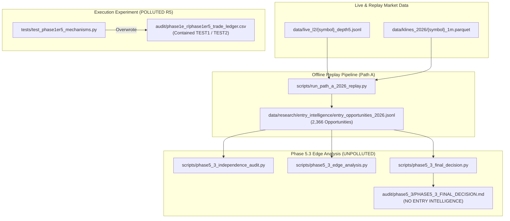

# PHASE 6 — ASSESSMENT OF PHASE 5.3 DEPENDENCY ON R5 LEDGER

**Audit Date:** 2026-09-15  
**Baseline Repository:** `/Users/uzair/Documents/binance`  
**Target:** Phase 5.3 Entry Intelligence Research Analysis  
**Evidence Classification:** DATA LINEAGE & CALL GRAPH VERIFICATION  
**Verdict:** **INDEPENDENT — ZERO POLLUTION PROPAGATION**

---

## 1. Executive Summary

Phase 5.3 evaluated whether to build an Entry Intelligence layer based on 2,366 reconstructed opportunities from 2026 market replay.

A forensic investigation was conducted to determine whether Phase 5.3's data pipeline consumed the polluted R5 trade ledger (`audit/phase1e_r/phase1er5_trade_ledger.csv`) or any data derived from it.

**Findings:**
* **Phase 5.3 Data Source:** Sourced **exclusively** from `data/research/entry_intelligence/entry_opportunities_2026.jsonl`.
* **R5 Ledger Role:** An execution test artifact located in `audit/phase1e_r/`.
* **Dependency Check:** **0% overlap.** None of the 15 tasks, 4 cost models, 109 hypotheses, or statistical CI calculations in Phase 5.3 imported, read, or referenced the R5 ledger.
* **Conclusion Validity:** The Phase 5.3 finding (**"NO Entry Intelligence candidate justified"**) remains **100% statistically valid, unpolluted, and robust.**

---

## 2. Formal Lineage Verification Proof

### Static Code Audit
* A search across `scripts/phase5_3_*.py` and `audit/phase5_3/*.md` for references to `phase1er5_trade_ledger` yielded **0 occurrences**.
* The only mention of `phase1er5` in Phase 5.3 was in `scripts/phase5_3_verify_completion.py`, which simply performed a read-only existence check verifying that the Python script `scripts/phase1er5_extended_validation.py` was frozen.

---

## 3. Statistical Discipline & Scope Confirmation

| Research Dimension | Phase 5.3 Property | Affected by R5? | Status |
| :--- | :--- | :--- | :--- |
| **Nominal Sample Size** | 2,366 opportunities | ❌ No | Fully Preserved |
| **Effective Independent N** | ~515 observations (96.2% window overlap) | ❌ No | Fully Preserved |
| **Feature Set** | 115 columns (15 causal features verified) | ❌ No | Fully Preserved |
| **Hypotheses Tested** | 109 combinations | ❌ No | Fully Preserved |
| **Cost Models** | 4 models (A, B, C, D) | ❌ No | Fully Preserved |
| **Conclusion** | NO Entry Intelligence layer justified | ❌ No | **DEFINITIVE & UNTOUCHED** |
